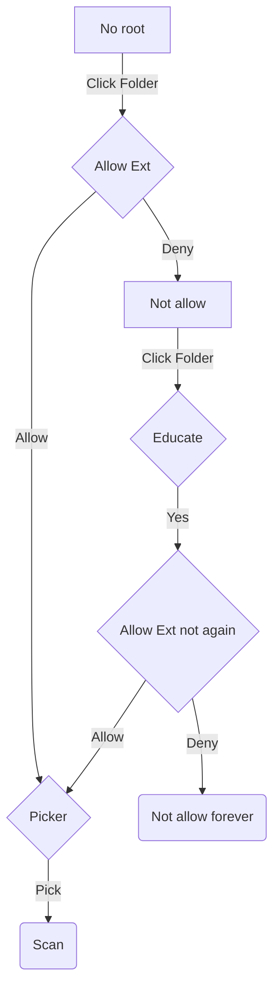

# State for list comic view

This is an incomplete list of states for the list comic view in Library fragment.
An interactive one is being created [here](https://app.diagrams.net/#G1vVbMf8XX_1M9Dhzb62Zwcm9M27VDSvJg).

